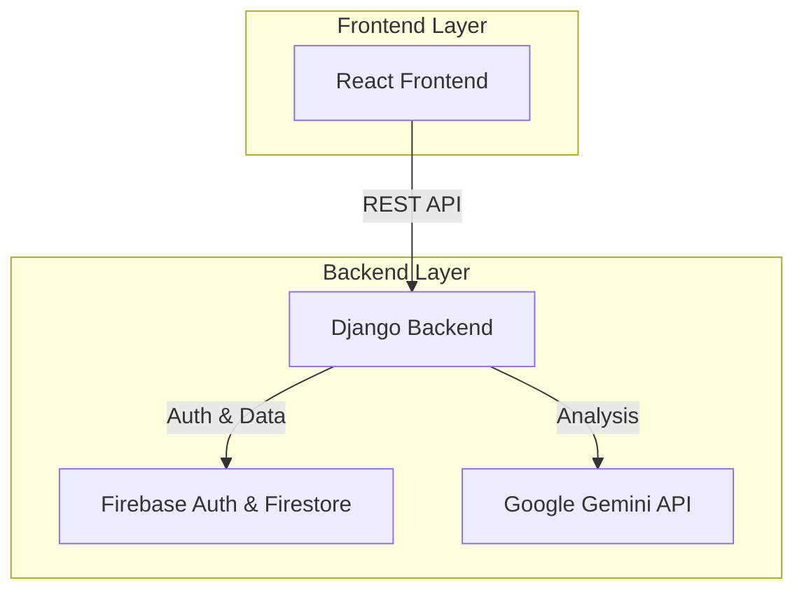

# RuralHealthAI: AI-Powered Digital Health Screening

<div align="center">
  
  <br />
  <p>
    <b>Democratizing access to preventative healthcare with intelligent, offline-capable digital tools.</b>
  </p>
  <br />

  
  
  
  
  

</div>

---

## 📋 Table of Contents

-   [Overview](#-overview)
-   [Key Features](#-key-features)
-   [System Architecture](#-system-architecture)
-   [Tech Stack](#-tech-stack)
-   [Getting Started](#-getting-started)
    -   [Prerequisites](#prerequisites)
    -   [Backend Setup](#backend-setup)
    -   [Frontend Setup](#frontend-setup)
-   [Configuration](#-configuration)
-   [API Documentation](#-api-documentation)
-   [Roadmap](#-roadmap)
-   [License](#-license)
-   [Contact](#-contact)

---

## 🏥 Overview

**RuralHealthAI** is a comprehensive digital health screening platform designed to empower frontline health workers (ASHAs) in rural areas. By conducting simple screenings for Non-Communicable Diseases (NCDs) like Diabetes and Hypertension, health workers can identify risks early and connect patients to care.

Key challenges addressed:
-   **Lack of Specialists:** Bridging the gap where doctors are scarce.
-   **Late Diagnosis:** Identifying "silent killers" before they become critical.
-   **Manual Records:** Digitizing health data for better tracking and analysis.

---

## ✨ Key Features

-   **🤖 AI-Powered Analysis:** Integration with **Google Gemini AI** to analyze vitals and provide instant risk assessments and lifestyle recommendations.
-   **📱 Role-Based Access:** tailored interfaces for **Health Workers** (screening), **Health Officers** (monitoring), and **Admins**.
-   **🔒 Secure & Private:** Robust authentication via **Firebase Auth** and secure data storage in **Firestore**.
-   **📊 Interactive Dashboard:** Visual analytics for screening trends and high-risk case tracking.
-   **⚡ Modern UI:** Fast, responsive interface built with React, Tailwind CSS, and Framer Motion.
-   **📝 Digital Health Records:** Comprehensive patient history tracking.

---

## 🏗 System Architecture

The project follows a modern Client-Server architecture:



---

## 💻 Tech Stack

### Frontend
-   **Framework:** React 18 (Vite)
-   **Language:** TypeScript
-   **Styling:** Tailwind CSS, ShadCN UI
-   **State:** React Context API, React Query
-   **Icons:** Lucide React

### Backend
-   **Framework:** Django + Django REST Framework (DRF)
-   **Language:** Python 3.10+
-   **Request Handling:** `requests` (for external APIs), `django-cors-headers`

### Database & Cloud
-   **Database:** Google Firebase Firestore (NoSQL)
-   **Authentication:** Firebase Authentication
-   **AI Model:** Google Gemini Pro

---

## 🚀 Getting Started

Follow these steps to set up the project locally.

### Prerequisites
-   **Node.js** (v18+)
-   **Python** (v3.10+)
-   **Firebase Account** (for API keys)

### Backend Setup

1.  **Clone the repository:**
    ```bash
    git clone https://github.com/yourusername/RuralHealthAI.git
    cd RuralHealthAI/backend
    ```

2.  **Create a virtual environment:**
    ```bash
    python -m venv venv
    
    # Windows
    venv\Scripts\activate
    
    # Mac/Linux
    source venv/bin/activate
    ```

3.  **Install dependencies:**
    ```bash
    pip install -r requirements.txt
    ```

4.  **Configure Environment Variables:**
    Create a `.env` file in the `backend/` directory (see [Configuration](#-configuration)).

5.  **Run Migrations:**
    ```bash
    python manage.py migrate
    ```

6.  **Start the Server:**
    ```bash
    python manage.py runserver
    ```

### Frontend Setup

1.  **Navigate to frontend directory:**
    ```bash
    cd ../frontend
    ```

2.  **Install dependencies:**
    ```bash
    npm install
    ```

3.  **Configure Environment Variables:**
    Copy `.env.example` to `.env` and fill in your Firebase credentials.

4.  **Start the Development Server:**
    ```bash
    npm run dev
    ```

---

## ⚙ Configuration

### Backend (`backend/.env`)
```env
SECRET_KEY=your_django_secret_key
DEBUG=True
ALLOWED_HOSTS=localhost,127.0.0.1
GEMINI_API_KEY=your_google_gemini_api_key
```

### Frontend (`frontend/.env`)
```env
VITE_FIREBASE_API_KEY=your_api_key
VITE_FIREBASE_AUTH_DOMAIN=your_project.firebaseapp.com
VITE_FIREBASE_PROJECT_ID=your_project_id
VITE_FIREBASE_STORAGE_BUCKET=your_bucket
VITE_FIREBASE_MESSAGING_SENDER_ID=your_sender_id
VITE_FIREBASE_APP_ID=your_app_id
```

---

## 📖 API Documentation

The backend exposes a RESTful API. Key endpoints include:

| Method | Endpoint | Description |
| :--- | :--- | :--- |
| **POST** | `/api/auth/register` | Register a new user |
| **POST** | `/api/auth/login` | Authenticate user |
| **GET** | `/api/patients` | List all patients |
| **POST** | `/api/patients` | Add a new patient |
| **POST** | `/api/screenings` | Submit screening data for AI analysis |

For detailed documentation, visit the `/api-docs` route on the frontend.

---

## 🗺 Roadmap

- [x] MVP Development (Screening & AI Analysis)
- [x] **New:** Forgot Password & Visibility Toggle
- [ ] Offline Mode (PWA)
- [ ] Voice-Based Vitals Screening
- [ ] Multi-language Support (Hindi/Vernacular)
- [ ] SMS/WhatsApp Report Integration

---

## 📄 License

Distributed under the MIT License. See `LICENSE` for more information.

---

## 📞 Contact

**Alisha Shad** - [LinkedIn](https://www.linkedin.com/in/alisha-shad-983456380/) - [GitHub](https://github.com/alishashad) - [Email](mailto:alishasshad@gmail.com)

Project Link: [https://github.com/alishashad/RuralHealthAI](https://github.com/alishashad/RuralHealthAI)
